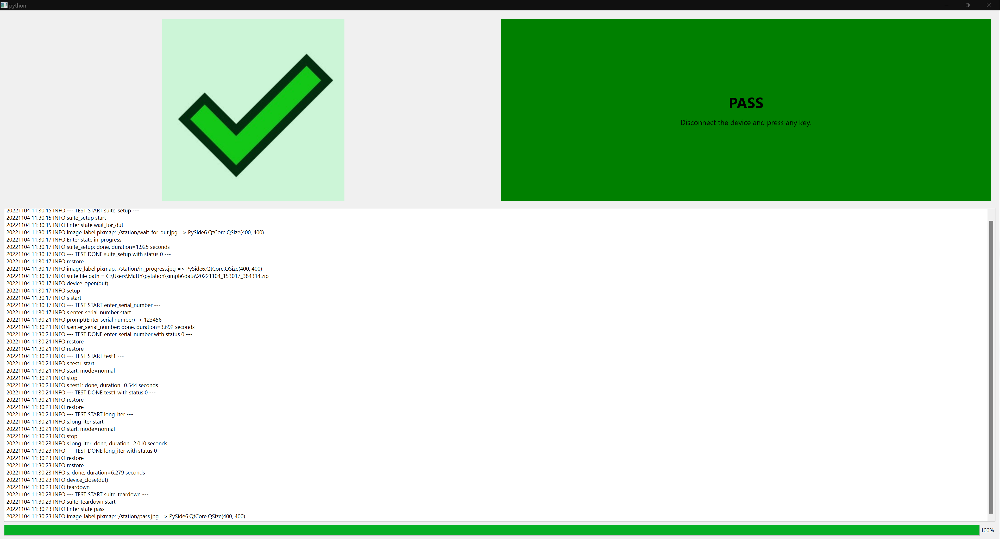

<!--
# SPDX-FileCopyrightText: Copyright 2021-2026 Jetperch LLC
# SPDX-License-Identifier: Apache-2.0
#
# Licensed under the Apache License, Version 2.0 (the "License");
# you may not use this file except in compliance with the License.
# You may obtain a copy of the License at
#
#     http://www.apache.org/licenses/LICENSE-2.0
#
# Unless required by applicable law or agreed to in writing, software
# distributed under the License is distributed on an "AS IS" BASIS,
# WITHOUT WARRANTIES OR CONDITIONS OF ANY KIND, either express or implied.
# See the License for the specific language governing permissions and
# limitations under the License.
-->

# Pytation

Welcome to the Pytation project!  Use Pytation to quickly build reliable
test stations for your custom hardware projects.  Although building
manufacturing test stations is the primary goal of this project, you can
also build repeatable development and validation test stations.
The framework allows you to run tests using a variety of runners including the
graphical PySide6 runner and command line runner.

Project links:

* [Documentation](https://jetperch.github.io/pytation/) on GitHub Pages
* [Releases](https://pypi.org/project/pytation/) on pypi
* [Source Code](https://github.com/jetperch/pytation/) on GitHub

## Terminology and Architecture

A **station** represents a physical test setup — the equipment, instruments,
and fixtures used to test hardware units.  A station starts once, opens
long-lived equipment, and runs continuously until the operator shuts it down.

Each unit under test goes through a **suite** — a single pass through the
full list of tests.  The suite captures all results for that unit into a
ZIP file and then resets so the next unit starts fresh.  A station runs
suites in a loop: load a unit, run the suite, save results, repeat.

A **test** is a single test function within a suite.  Each test receives a
**context** object that provides access to devices, configuration,
environment variables, the output filesystem, and user interaction
(prompts, wait-for-user, progress reporting).

A **device** is a piece of equipment or instrument (e.g. a power supply,
oscilloscope, or the device under test itself).  Each device has a
**lifecycle** that controls when it is opened and closed:

* **station** (default) — opened once at station start, closed at station stop.
* **suite** — opened and closed with each suite (each unit).
* **test** — opened and closed around each individual test.
* **manual** — opened and closed explicitly by test code.

A **runner** drives the station.  Pytation provides two built-in runners:

* **GUI runner** — a PySide6 graphical interface with state images, progress
  bars, and prompt dialogs.
* **CLI runner** — a command-line interface for headless or scripted operation.

The execution lifecycle is:

    station_start
    │   station_setup
    │   for each unit:
    │   │   suite_setup          (e.g. wait for operator to load unit)
    │   │   for each test:
    │   │   │   test_setup
    │   │   │   test function    (receives Context)
    │   │   │   test_teardown
    │   │   suite_teardown       (e.g. display PASS/FAIL, wait for removal)
    │   │   save results to ZIP
    station_stop
        station_teardown

## Quick Start

You will need Python 3.9 or newer.  You can install this package using pip:

    pip3 install -U pytation

Alternatively, you can clone the repo:

    git clone https://github.com/jetperch/pytation.git
    cd pytation
    pip3 install -U -r requirements.txt
    python3 setup.py qt

You can then run the example:

    python3 -m pytation gui pytation_examples.simple.STATION

On Windows, you may need to use `python` rather than `python3`.

## License

All pytation code is released under the permissive Apache 2.0 license.
See the [License File](LICENSE.txt) for details.
