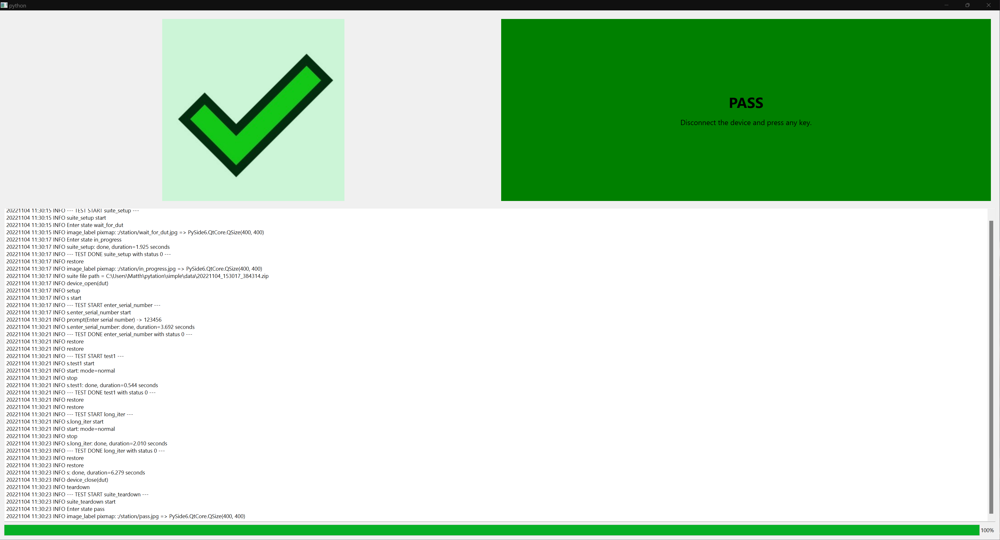

# Pytation

Welcome to the Pytation project!  Use Pytation to quickly build reliable
test stations for your custom hardware projects.  Although building
manufacturing test stations is the primary goal of this project, you can
also build repeatable development and validation test stations.
The framework allows you to run tests using a variety of runners including the
graphical PySide6 runner and command line runner.

Project links:

* [Documentation](https://jetperch.github.io/pytation/) on GitHub Pages
* [Releases](https://pypi.org/project/pytation/) on pypi
* [Source Code](https://github.com/jetperch/pytation/) on GitHub

## Quick Start

You will need Python 3.9 or newer.  You can install this package using pip:

    pip3 install -U pytation

Alternatively, you can clone the repo:

    git clone https://github.com/jetperch/pytation.git
    cd pytation
    pip3 install -U -r requirements.txt
    python3 setup.py qt

You can then run the example:

    python3 -m pytation gui pytation_examples.simple.STATION

On Windows, you may need to use `python` rather than `python3`.

## License

All pytation code is released under the permissive Apache 2.0 license.
See the [License File](LICENSE.txt) for details.
