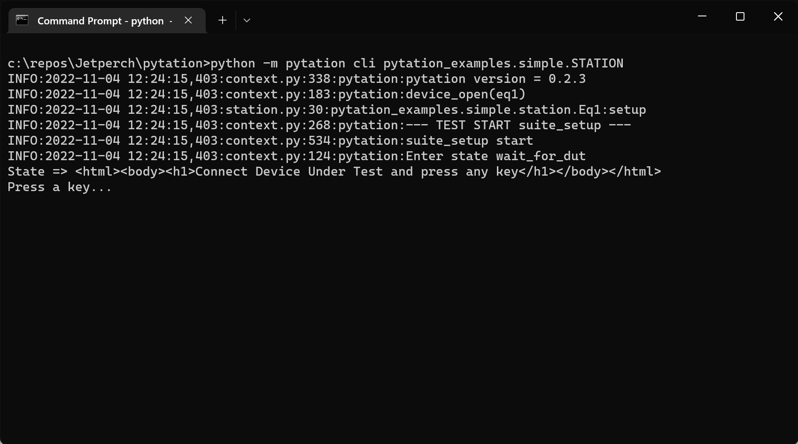
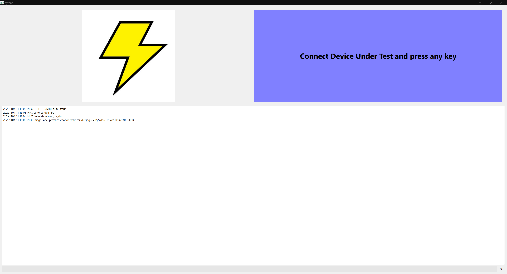

.. Pytation documentation master file

.. image:: https://github.com/jetperch/pytation/actions/workflows/windows.yml/badge.svg
    :target: https://github.com/jetperch/pytation

Pytation
========

Welcome to the Pytation project!  Use Pytation to quickly build reliable
test stations for your custom hardware projects.  Although building
manufacturing test stations is the primary goal of this project, you can
also build repeatable development and validation test stations.
The framework allows you to build test suites that you can
execute using the included runners.

Run from the command line:

Or run from a PySide6 graphical user interface:

Easily add tests, add devices, configure test options,
add custom operator prompts, and more.

This package runs on any host platform including Windows, macOS, and
Linux as long as Python 3.9+ is installed.  The GUI runner requires
PySide6.  As of 2022-11-04, PySide6 is not supported on the Raspberry Pi.

To install, type::

    pip3 install -U pytation

You may want to use a virtual environment to help isolate the test station
dependencies.
See the `venv documentation <https://docs.python.org/3/library/venv.html>`_
for details.

You can then easily run the examples:

    python -m pytation cli pytation_examples.simple.STATION
    python -m pytation gui pytation_examples.simple.STATION

The pytation package is Copyright 2021-2022 Jetperch LLC and released
under the permissive :ref:`Apache 2.0 license <license>`.

You can find this project on:

* Releases: `pypi <https://pypi.org/project/pytation/>`_
* Source Code: `GitHub <https://github.com/jetperch/pytation>`_
* Documentation: TBD

Table of Contents
=================

.. toctree::
    :maxdepth: 2

    quickstart
    cli_runner
    gui_runner
    changelog
    license

Indices and tables
==================

* :ref:`genindex`
* :ref:`modindex`
* :ref:`search`
